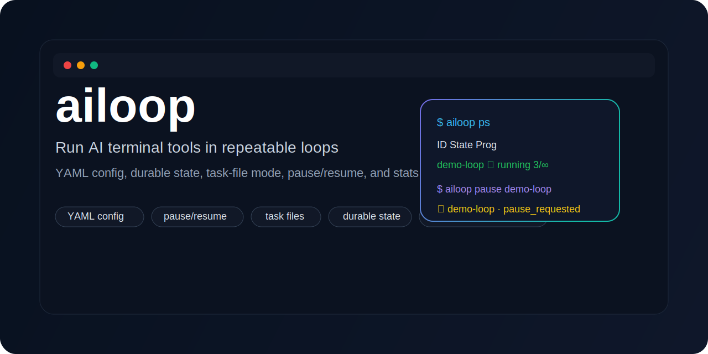

# ailoop 🔁

[](https://pypi.org/project/ailoop/)
[](https://pypi.org/project/ailoop/)
[](LICENSE)
[](#quick-start)
[](#quick-start)
[](#quick-start)
[](#why-ailoop-)
[](#task-file-mode-)
[](docs/index.md)
[](https://dmoliveira.github.io/ailoop/)
[](docs/support.md)
[](https://github.com/dmoliveira)



> ## Run AI terminal tools in repeatable loops
>
> YAML config, durable state, task-file mode, pause/resume, and stats for OpenCode, Codex, Claude, and more.
>
> Docs: [GitHub Pages](https://dmoliveira.github.io/ailoop/) · [docs/index.md](docs/index.md)
>
> Author: [@dmoliveira](https://github.com/dmoliveira) · [LinkedIn](https://www.linkedin.com/in/dmoliveira/)
>
> Support: https://buy.stripe.com/8x200i8bSgVe3Vl3g8bfO00

`ailoop` is a small CLI for repeatable AI terminal loops with durable state, task-file mode, pause/resume controls, and machine-friendly output.

It is built for people who want a simple way to run AI terminal tools like **OpenCode**, **Codex**, and **Claude Code** in safe repeatable loops instead of brittle one-off shell snippets.

## Why ailoop? 🧭

Most AI terminal workflows start as a quick `while true` loop, then grow messy fast.

`ailoop` gives you:

- ✅ repeatable loop runs
- ✅ YAML config + CLI overrides
- ✅ durable local state
- ✅ pause / resume / stop controls
- ✅ strict Markdown task-file mode
- ✅ stats, logs, and tail commands
- ✅ JSON output for automation

## Quick start ⚡

Install:

```bash
uv sync
```

Start:

```bash
ailoop init-config
ailoop run "Review the repo and keep iterating." --runner opencode --agent orchestrator
ailoop run "Do exactly 5 iterations." --steps 5
```

Task file mode:

```bash
ailoop init-task-file ./loop_tasks.md
ailoop check-task-file ./loop_tasks.md
ailoop run "Work the task list." --runner opencode --agent orchestrator --task-file ./loop_tasks.md --until-tasks-complete
```

Watch:

```bash
ailoop ps
ailoop tail <loop-id>
ailoop --json ps
```

Control:

```bash
ailoop pause <loop-id>
ailoop resume <loop-id>
ailoop stop <loop-id>
```

Inspect:

```bash
ailoop status <loop-id>
ailoop stats <loop-id>
ailoop logs <loop-id>
ailoop --json status <loop-id>
```

## Task file mode ✅

Generate a valid task file:

```bash
ailoop task-template
ailoop task-template --with-rules
ailoop init-task-file ./loop_tasks.md
ailoop check-task-file ./loop_tasks.md
ailoop --json check-task-file ./loop_tasks.md
```

Format:

```md
# Loop Tasks

## To do
- [ ] First task

## Doing
- None

## Done
- None
```

Rules:

- use only `To do`, `Doing`, `Done`
- `To do`: only `- [ ] task` or `- None`
- `Doing`: only `- [ ] task` or `- None`
- `Done`: only `- [x] task` or `- None`
- keep max 1 task in `Doing`
- move task `To do -> Doing` when start
- move task `Doing -> Done` and mark `[x]` when done

Exit codes:

- `0`: valid and done
- `10`: valid but still open (`--state-exit-code`)
- `1`: invalid file

## Commands 🧰

Core:

```bash
ailoop run "Prompt"
ailoop resume <loop-id>
ailoop pause <loop-id>
ailoop stop <loop-id>
```

Watch + inspect:

```bash
ailoop ps
ailoop list --active
ailoop status <loop-id>
ailoop stats <loop-id>
ailoop logs <loop-id>
ailoop tail <loop-id>
```

Task files:

```bash
ailoop init-task-file ./loop_tasks.md
ailoop check-task-file ./loop_tasks.md
ailoop check-task-file ./loop_tasks.md --state-exit-code
```

JSON + output modes:

```bash
ailoop --json ps
ailoop --json status <loop-id>
ailoop --json logs <loop-id>
ailoop --quiet check-task-file ./loop_tasks.md
ailoop --verbose check-task-file ./loop_tasks.md
ailoop --color always status <loop-id>
```

## Config ⚙️

Default config path:

```text
~/.config/ailoop/config.yaml
```

Example:

```yaml
default_runner: opencode
default_agent: orchestrator

paths:
  agent_file: ~/Codes/Projects/agents_md/AGENTS.md
  state_dir: ~/.config/ailoop/state

prompt:
  pre_prompt_enabled: true
  attach_agent_file: true
  pre_prompt: |
    Work in small validated slices.
    Review current context before starting new work.
    Leave concise progress, blockers, and next action at the end.

loop:
  steps: null
  pause_seconds: 30
  continue_on_error: true
  retry_count: 0

runners:
  opencode:
    command: opencode
    args: ["run", "--agent", "{agent}", "{prompt}"]
  codex:
    command: codex
    args: ["{prompt}"]
  claude:
    command: claude
    args: ["{prompt}"]
```

## Prompt assembly ✍️

Each iteration prompt is assembled in this order:

1. pre-prompt if enabled
2. agent file contents if enabled
3. user prompt
4. loop context block with iteration and previous result summary

Prompt and run logs are stored under the loop log directory for inspection.

## Docs 📚

- [docs hub](docs/index.md)
- [GitHub Pages site](https://dmoliveira.github.io/ailoop/)
- [config guide](docs/config.md)
- [task-file mode](docs/task-file.md)
- [examples](docs/examples.md)
- [runners](docs/runners.md)
- [hero banner brief](docs/branding/hero-banner-brief.md)

## Support 💛

If `ailoop` saves you time, you can support ongoing maintenance and future releases here:

- Stripe: https://buy.stripe.com/8x200i8bSgVe3Vl3g8bfO00

Author:

- GitHub: [@dmoliveira](https://github.com/dmoliveira)
- LinkedIn: [Diego Marinho de Oliveira](https://www.linkedin.com/in/dmoliveira/)

More: [docs/support.md](docs/support.md)

## License 📝

MIT
